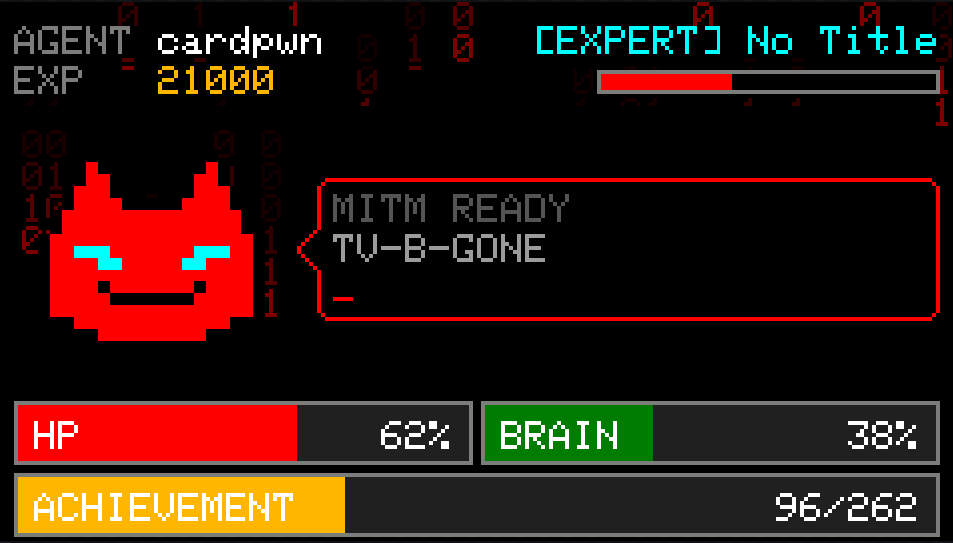
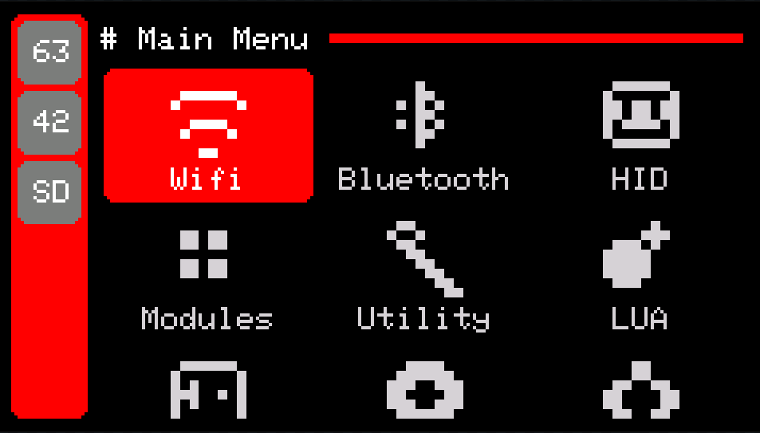
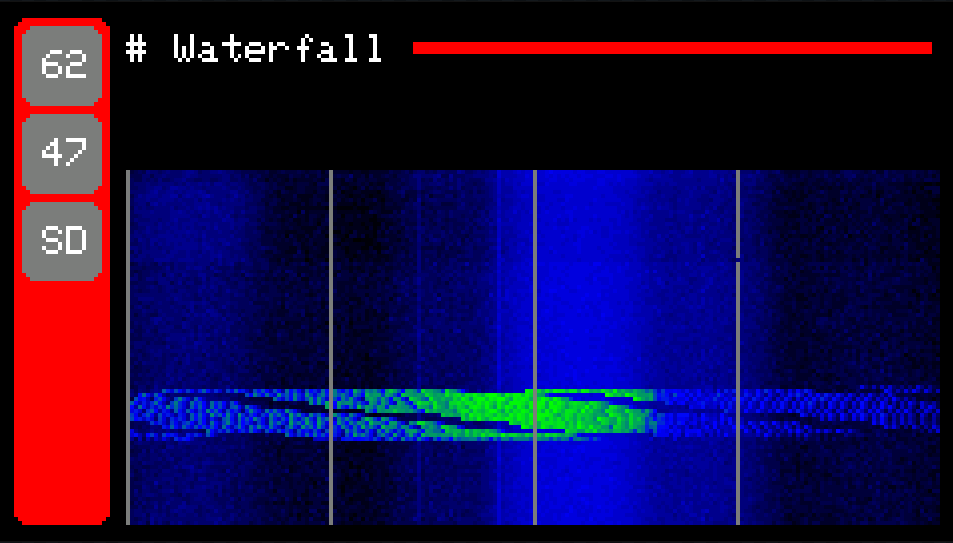

<div align="center">


# UniGeek Firmware

**Multi-tool firmware for ESP32-based handheld devices.**
Built with PlatformIO + Arduino framework + TFT_eSPI.


</div>

---

<p align="center">
  
  
  
</p>

---

## What is it?

UniGeek is a single codebase that runs across ~18 ESP32 handheld boards, turning each into a
pocket security & RF multi-tool: WiFi attacks, Bluetooth scanning/spam, USB & BLE HID, NFC,
IR, Sub-GHz (CC1101), NRF24, GPS wardriving, plus utilities and games.

The **complete, always-current feature list lives on the docs site** — it's generated from the
firmware menu, so it never drifts:

👉 **https://unigeek.xid.run/features/**

### Highlights

- 📶 **Wi-Fi Attacks** — Evil Twin, Karma, beacon/SSID flood, deauther, EAPOL (WPA2) capture & offline crack, captive portals, packet monitor
- 🔵 **BLE Attacks** — device/beacon spam (Fast Pair, Continuity, Samsung), passive detector (Flipper/AirTag/skimmer), WhisperPair (CVE-2025-36911), BLE analyzer
- 📡 **Sub-GHz (CC1101)** — capture / replay / jam, peak frequency detector, 38 brand protocol decoders, KeeLoq auto-decode + rolling-code Replay +1
- 🛰️ **RF & GPS** — NRF24 spectrum / jammer / MouseJack, M5 RF433, GPS wardriving with Wigle export and on-device map
- 🪪 **NFC** — MIFARE Classic key recovery (dictionary, nested, darkside), PN532 / PN532Killer, Chameleon Ultra BLE client
- 📺 **IR** — capture, replay, TV-B-Gone, Flipper-IRDB compatible
- ⌨️ **HID** — USB & BLE keyboard, DuckyScript 3.0, mouse jiggle, WebAuthn/FIDO2 passkey, USB mass storage
- 🌐 **Network** — MITM, CCTV sniffer, cast bomb, printer prank, mDNS spam, web/BLE file manager, Wikipedia browser
- 🧰 **Utility & Games** — QR/barcode, TOTP, UART terminal, password manager, Lua runner, achievements, and several on-device games

> Each item links to step-by-step docs on the [features site](https://unigeek.xid.run/features/).

---

## Supported Devices

| Device | Keyboard | Speaker | USB HID | SD Card | Power Off |
|--------|----------|---------|---------|---------|-----------|
| M5StickC Plus 1.1 | — | Buzzer | — | — | Yes |
| M5StickC Plus 2 | — | — | — | — | Yes |
| LilyGO T-Lora Pager | TCA8418 | I2S | Yes | Yes | Yes |
| M5Stack Cardputer | GPIO Matrix | I2S | Yes | Yes | — |
| M5Stack Cardputer ADV | TCA8418 | I2S + ES8311 | Yes | Yes | — |
| LilyGO T-Display | 2 Buttons | — | — | — | — |
| LilyGO T-Display S3 | 2 Buttons | — | Yes | — | — |
| LilyGO T-Display S3 Touch | 2 Buttons + Touch (CST820) | — | Yes | — | — |
| LilyGO T-Embed CC1101 | Rotary Encoder | I2S | — | Yes | — |
| M5Stack CoreS3 (Unified) | Touch | I2S | Yes | Yes | — |
| M5Stick S3 | 2 Buttons | I2S | Yes | — | — |
| DIY Smoochie | 5 Buttons | — | — | Yes | — |
| CYD 2432W328R / 2432S024R | Touch (XPT2046) | — | — | Yes | — |
| CYD 2432S028 | Touch (XPT2046) | — | — | Yes | — |
| CYD 2432S028 (2USB) | Touch (XPT2046) | — | — | Yes | — |
| CYD 2432W328C | Touch (CST816S) | — | — | Yes | — |
| CYD 3248S035R | Touch (XPT2046) | — | — | Yes | — |
| CYD 3248S035C | Touch (GT911) | — | — | Yes | — |

> **Known issue — M5Stick S3:** IR receive is not functional (RMT conflict with the ES8311 speaker); IR transmit works normally.

---

## Build & Flash

Install [PlatformIO](https://platformio.org/), pick your board's environment, then:

```bash
pio run -e <env>              # build
pio run -e <env> -t upload    # build + flash
pio device monitor            # serial monitor
```

Common environments: `m5stickcplus_11`, `m5stickcplus_2`, `t_lora_pager`, `m5_cardputer`,
`m5_cardputer_adv`, `t_display`, `t_display_s3`, `t_embed_cc1101`, `m5_cores3_unified`,
`m5sticks3`, `diy_smoochie`, `cyd_2432s028`, `cyd_3248s035c` … (see `platformio.ini` for the full list).

---

## Navigation

Controls depend on the hardware (buttons, keyboard, encoder, or touch).

| Action | M5StickC (Default) | M5StickC (Encoder) | Cardputer / T-Lora Pager |
|--------|--------------------|--------------------|--------------------------|
| Up | AXP button | Rotate CCW | `;` |
| Down | BTN\_B | Rotate CW | `.` |
| Select | BTN\_A | Encoder press | `Enter` |
| Back | — | BTN\_A (short press) | `Backspace` |
| Left | — | AXP button | `,` |
| Right | — | BTN\_B | `/` |

On M5StickC, hold **BTN\_A for 3 s** to reset navigation mode to Default.

---

## Storage

Files live under `/unigeek/` on SD card when available, otherwise LittleFS (always present as fallback).
Key paths: `config`, `hid/`, `wifi/`, `nfc/`, `rf/`, `gps/`, `utility/`, `web/`, `achievements.bin`.

Sample files can be pulled straight to the device via **WiFi → Network → Download**.

---

## Project Structure

```
firmware/
├── boards/        board-specific hardware implementations (one dir per board)
└── src/
    ├── core/      interfaces and shared drivers (IStorage, ISpeaker, ScreenManager, …)
    ├── screens/   UI screens by category (wifi, ble, hid, module, utility, game, setting)
    ├── ui/        templates, components, and action overlays
    └── utils/     protocol/driver logic (HID, DuckyScript, nfc, gps, rf, ir, …)
```

All hardware differences are isolated under `firmware/boards/<board>/`.

---

## Credits

Built with inspiration and reference from these projects — thank you:

- [Evil-M5Project](https://github.com/7h30th3r0n3/Evil-M5Project) — WiFi attacks, captive portals, EAPOL, BLE spam/detector, CCTV sniffer
- [Bruce](https://github.com/pr3y/Bruce) — board/pin definitions, IR (TV-B-Gone), Sub-GHz CC1101, BLE spam payloads, NRF24
- [Flipper-IRDB](https://github.com/Flipper-XFW/Flipper-IRDB) — infrared remote database
- [FrostedFastPair](https://github.com/pivotchip/FrostedFastPair) — WhisperPair (CVE-2025-36911)
- [ChameleonUltraGUI](https://github.com/GameTec-live/ChameleonUltraGUI) — Chameleon Ultra BLE protocol
- [pn532-python](https://github.com/whywilson/pn532-python) — PN532 / PN532Killer HSU protocol
- [claude-desktop-buddy](https://github.com/anthropics/claude-desktop-buddy) — Claude Buddy BLE desk pet
- [pico-fido](https://github.com/polhenarejos/pico-fido) (AGPLv3) — WebAuthn / FIDO2 CTAP 2.1 reference
- [LilyGoLib](https://github.com/Xinyuan-LilyGO/LilyGoLib) & [M5Unified](https://github.com/m5stack/M5Unified) — hardware references
